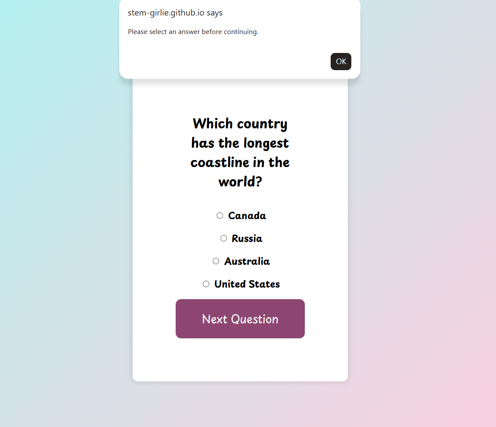
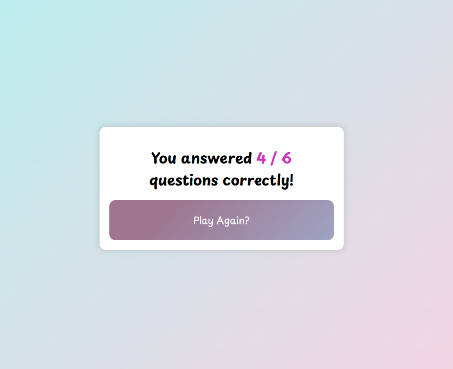
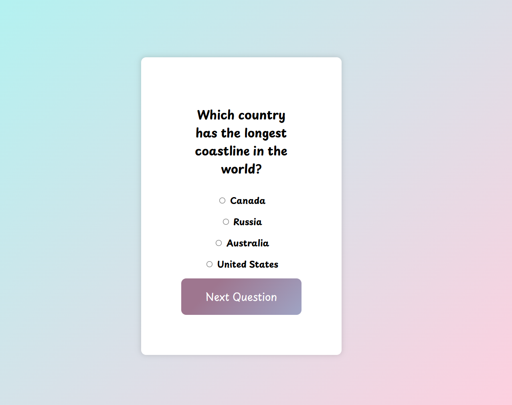

# 🎉 Quiz App  
A simple, colourful, browser‑based quiz application built with **HTML, CSS, and JavaScript**.  
This project was created to practise DOM manipulation, event handling, and dynamic UI updates — all wrapped in a playful gradient design.

---

## ✨ Features  
- Multiple‑choice questions  
- Randomised answer order on every load  
- Score tracking  
- Required answer selection (no skipping questions)  
- Clean final results screen  
- “Play Again” button to restart the quiz  
- Fully responsive layout  
- Soft pastel UI inspired by gradient design resources  

---

## 🧠 What I Learned  
This project helped me strengthen core front‑end skills:

- Updating the DOM dynamically  
- Handling user input with radio buttons  
- Shuffling arrays using the Fisher–Yates algorithm  
- Validating user actions (forcing answer selection)  
- Replacing HTML content with JavaScript (`innerHTML`)  
- Structuring reusable functions  
- Styling components with gradients and flexbox  

---

## 🛠️ Technologies Used  
- **HTML5**  
- **CSS3**  
- **JavaScript (ES6+)**  

---

## 🚀 Live Demo  
You can view the live version here:  
👉 [https://stem-girlie.github.io/QuizApp/](https://stem-girlie.github.io/QuizApp/)

---

## 📦 How It Works  
1. Questions are stored in a JavaScript array.  
2. Each time a question loads, the answer options are shuffled.  
3. The user must select an answer before moving on.  
4. The app checks correctness and updates the score.  
5. At the end, the quiz displays a final score and a restart button.

---

## 📸 Preview  

---

## 🔁 Future Improvements  
- Add a progress bar  
- Add a timer  
- Add categories or difficulty levels  
- Add animations for transitions  
- Store high scores in localStorage
- Shuffle answers to questions after refresh 

---

## 💡 Inspiration  
This project is part of my ongoing front‑end practice — building small, functional apps to strengthen my JavaScript fundamentals and UI design skills.

---
